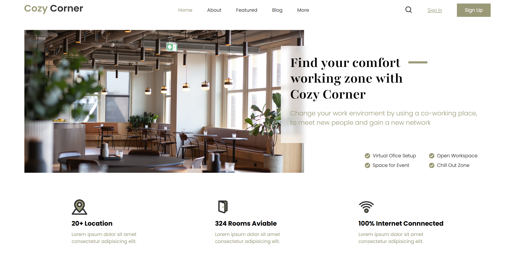

## Header Proyect (non-responsive)
---
This is a front-end practice project focused on building a **header and hero section** using **HTML**, **Sass**, and **Vite**.  
The design was created for **large screens (1800x1080)** and follows a clean, modern layout structure.


---

## 🧠 Technologies Used
- HTML5  
- Sass (modular architecture with partials and imports)  
- Vite (for fast development and live reloading)

## 🚀 Getting Started

To run the project locally:

```bash
# Clone this repository
git clone https://github.com/YOUR-USERNAME/header-no-responsive.git


# Navigate to the project folder
cd cowrking_space

# Install dependencies
npm install

# Start the local development server
npm run dev
```

---


### Project Overview 🎨

Built from scratch without responsive design, optimized for desktop view (1800x1080).

Uses a structured Sass setup:

- `abstracts/` for variables and global settings

- `layout/` fcontains `_nav.scss` and `_hero.scss` sections, plus main container and body styling


### Future Improvements 💡

- Add responsive design using Sass mixins and breakpoints.

- Implement mobile and tablet layouts.

---
### Preview
<p>
 
</p>

---
### About This Project 📚
This project was made as part of my **Full Stack Developer Master’s program**, to practice layout building and Sass workflow.